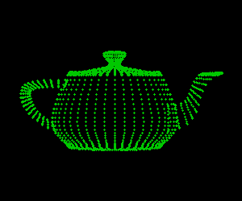

# pygeom_tools

[](https://app.travis-ci.com/github/Daiver/pygeom_tools)

[WIP] Simple tools for wavefront obj IO and processing.

It's pretty dirty and slow. No obj file validation. Also it supports only vertices, uv, basic topology and polygroups. Normals, materials, etc, will be ignored 

# Example

```python
import geom_tools
path_to_obj = "models/teapot.obj"
model = geom_tools.load(path_to_obj)
# Or, if you want to load only vertices:
# vertices = geom_tools.load_vertices(path_to_obj)  # Super fast due to C++ extension
# Print various statistics 
print(
    f"Model loaded, "
    f"n vertices: {model.n_vertices()}, "
    f"n vts: {model.n_texture_vertices()}, "
    f"n polygons: {model.n_polygons()}, "
    f"n triangles: {model.n_triangles()}"
)
# or simply
print(model.summary())
print(model.vertices[:5])  # NumPy array, same for texture vertices, etc
print(model.polygon_vertex_indices[:5])  # List of lists, same for texture topology, triangulated topology, etc
print(model.triangle_vertex_indices[:5])  # Fan like triangulation of topology. Keep original triangles

model.vertices[0] = (1, 2, 3)
geom_tools.save(model, "res.obj")    


# Vertices render, requires opencv
import cv2
import numpy as np

canvas_size = (600, 500)
fit_to_view_transformation = geom_tools.fit_to_view_transform(
    bbox=model.bbox(),
    canvas_size=canvas_size
)
vertices = geom_tools.transform_vertices(fit_to_view_transformation, model.vertices)
canvas = np.zeros((canvas_size[1], canvas_size[0], 3), dtype=np.uint8)
for v in vertices.round().astype(np.int32):
    cv2.circle(canvas, (v[0], v[1]), 1, (0, 200, 0), -1)
cv2.imshow("", canvas)
cv2.waitKey()

```

Result render:




See `geom_tools.mesh.Mesh` for more details. For saving stuff see `export_vertices_by_existing_obj`, `export_vertices_by_existing_obj_stream`

# Requires
 - Python 3.5 (3.6 + for examples)
 - NumPy
 - Pybind11

I prefer latest versions of interpreter/libraries but please let me know if you need compatibility with old versions 

# Installation

## Pip

```
pip3 install geom-tools
```

## Manual
```
git clone https://github.com/Daiver/pygeom_tools
cd pygeom_tools
python3 setup.py install
```

# TODO:

 - Topology related stuff   
   - Adjacency tables for polygons and triangles
   - Linked components search
 - Geodesics 

# Features
## Bounding box

```python
import numpy as np
from geom_tools import Mesh, BoundingBox
mesh = Mesh(
    vertices=np.array([[0, 1, 2], [1, 1, 2], [-5, 2, 3]]), polygon_vertex_indices=[[0, 1, 2]])
print(mesh.bbox())
# prints: BoundingBox([-5, 1, 2], [1, 2, 3])

# A lot of different helpers
bbox = BoundingBox([2, 1, 0], [3, 2, 1])
bbox.center()  # [2.5, 1.5, 0.5]
bbox.size()  # [0.5, 0.5, 0.5]
bbox.biggest_corner()  # [3, 2, 1]
bbox.smallest_corner()  # [2, 1, 0] 
```

## Vertices transformations

### Simple transformations

```python
import geom_tools
matrix = [
    [0, 1, 0],
    [1, 0, 0],
    [2, 0, 0]
]
vector = [2, 0, 3]

res = geom_tools.rotated_and_translated(
    rotation_matrix=matrix, translation=vector,
    vertices=[
        [0, 0, 0],
        [1, 0, 5],
    ]
)
print(res)    
# res = [
#     [2, 0, 3],
#     [2, 1, 5],
# ]

# Alternative syntax:
res = geom_tools.transform_vertices(
    (matrix, vector),
    vertices=[
        [0, 0, 0],
        [1, 0, 5],
    ]
)

# Yet another alternative with zero translation
res = geom_tools.rotated(
    rotation_matrix=matrix, 
    vertices=[
        [0, 0, 0],
        [1, 0, 5],
    ]
)

# Yet another alternative with zero rotation
res = geom_tools.translated(
    translation=[1, 2, 3],
    vertices=[
        [0, 0, 0],
        [1, 0, 5],
    ]
)

```

### Rotation around vertex to convenient transformation

```python
import geom_tools

rotation = [
   [0, -1, 0],
   [1, 0, 0],
   [0, 0, 1]
]
center = [0, 2, 0]
transformation = geom_tools.rotation_around_vertex(rotation, center, translation=[1, 2, 6])
vertices = [
   [1, 0, 0],
   [0, 1, 0],
   [0, 0, 1],
]
res = geom_tools.rigid_alignment.find_rotation_and_translation(transformation, vertices)
# res = [
#     [3, 5, 6],
#     [2, 4, 6],
#     [3, 4, 7],
# ]
```

### fit_to_view_transform

```python
import geom_tools
# Untested, returns transform which fit vertices to ortho camera 
width, height = 300, 200
geom_tools.fit_to_view_transform(bbox=geom_tools.BoundingBox(), canvas_size=(width, height))

```

## Alignment

```python
import geom_tools
# TODO: write readme about rigid alignment
transformation = geom_tools.rigid_alignment_transformation(src, dst)
```

## Adjacent vertices search
```python
import geom_tools
adj_table = geom_tools.vertices_adjacency_from_polygon_vertex_indices(geom.polygon_vertex_indices)
```

## Utils

```python
import geom_tools
# find center of vertices, works even for non 3d data
vertices = [
    [0, 0, 3],
    [1, 0, 1],
    [2, -0.3, 2]
]
res = geom_tools.center_of_vertices(vertices)  # [1.0, -0.1, 2]
```
